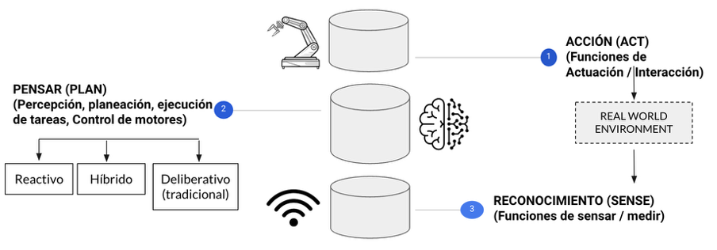

 

# Integración de Arquitecturas de IA en Drones para Fiscalización Pesquera.

**Eduardo Carrasco Vidal**, Oficial de Marina, Ingeniero Civil Industrial, Magister en Inteligencia Artificial

Enlace a la publicación del documento en [Revista de Marina, Año CXXXVIII, Volumen 141, Número 999.](https://revistamarina.cl/es/articulo/integracion-de-arquitecturas-de-ia-en-drones-para-fiscalizacion-pesquera) 
_________________________________________
  
_**Resumen:**
Este artículo presenta un sistema autónomo basado en UAVs para la fiscalización pesquera. Se propone una arquitectura de control reactiva para la planificación centralizada de rutas y reconocimiento por medio de visión artificial. Los resultados indican una reducción significativa del tiempo de inspección, con una mejora del 70% en comparación con los métodos actuales. Este enfoque cuantitativo valida la efectividad de los drones, reduciendo la dependencia de decisiones basadas en intuición._

**Palabras Claves:
Sistema Multi-agente, UAV, IA.**
_________________________________________

## Introducción:
La fiscalización pesquera es una tarea crítica para el mantenimiento de los ecosistemas marinos y la sostenibilidad de las industrias pesqueras. Tradicionalmente, esta vigilancia se ha basado en el despliegue de recursos humanos y equipos convencionales, enfrentando desafíos significativos en términos de cobertura geográfica y eficiencia operativa. El monitoreo efectivo de vastas zonas marítimas se ve limitado por restricciones logísticas y financieras, lo que a menudo resulta en la incapacidad de detectar y prevenir actividades ilícitas como la pesca ilegal, no declarada y no reglamentada (IUU ).
Ante esta problemática, las tecnologías emergentes ofrecen nuevas posibilidades. Los vehículos aéreos no tripulados (UAV s) se han identificado como una herramienta potencialmente transformadora en el campo de la vigilancia pesquera. Con la capacidad de cubrir grandes áreas a un costo operativo reducido, los UAVs representan una solución prometedora para mejorar la eficiencia y eficacia de las operaciones de fiscalización.
Este artículo introduce un enfoque diferente para la fiscalización pesquera mediante la implementación de un sistema autónomo basado en UAVs. La propuesta se centra en una arquitectura de control reactiva, que permite una planificación centralizada de rutas y una ejecución autónoma por parte de los drones. 
En este artículo, el autor explora cómo este enfoque se compara favorablemente con los métodos de fiscalización vigentes, destacando las mejoras en términos de alcance y tiempo de respuesta.
El sistema propuesto se evalúa mediante simulaciones y análisis de datos, cuyos resultados validan la hipótesis de que un enfoque basado en UAV puede mejorar significativamente la fiscalización pesquera.

---

### Descripción del problema:
Actualmente, la fiscalización a una embarcación se realiza de forma manual, para lo cual, desde un patrullero se despliegan botes fiscalizadores que se dirigen a cada embarcación pesquera para realizar la inspección, lo que toma un tiempo determinado. Pero, el problema se produce en zonas de pesca con múltiples embarcaciones, como el tiempo es acotado, el patrullero debe decidir cuáles de ellos serán fiscalizados, presentando un alto grado de incertidumbre en la toma de decisiones.
 Considerando lo anterior, se puede plantear el problema de forma generalizada como: “El proceso de fiscalización pesquera a través de los recursos actuales, tiene un componente humano que decide las embarcaciones a fiscalizar en base a información incompleta” y en ese contexto, se propone desarrollar un Sistema Multi-Agente de planificación centralizada de rutas, que permita a través de una torre central y drones (UAV), efectuar recorridos automáticos a todas las embarcaciones, de manera de reconocer/seleccionar los que representan condiciones fuera de norma, potencialmente contaminantes o poseen otras características particulares de atención, lo cual, se puede efectuar mediante Visión Artificial , para posteriormente dirigir un bote a efectuar la fiscalización. 
	
## Agentes y sus Arquitecturas:
El uso de vehículos autónomos, tanto aéreos como terrestres, se ha convertido en una estrategia clave para el monitoreo eficiente en áreas extensas. Estos vehículos han encontrado aplicaciones en una variedad de industrias, mostrando su capacidad para reducir la necesidad de intervención humana en zonas de riesgo o difícil acceso. En la agricultura, los vehículos autónomos son utilizados para identificar anomalías en el crecimiento de los cultivos y optimizar las cosechas. En el sector militar, ofrecen la posibilidad de llevar a cabo misiones ofensivas y defensivas minimizando el riesgo para el personal.
En términos de modelos de automatización, se destacan dos enfoques principales: centralizado y distribuido. El modelo centralizado se basa en la existencia de un agente maestro de nivel superior que planifica y asigna tareas a agentes esclavos de nivel inferior. Estos agentes esclavos, interactúan con elementos pasivos del sistema, como pueden ser las embarcaciones pesqueras. Aunque este modelo centralizado es eficiente en cuanto a la rapidez de transmisión de instrucciones, su dependencia de una unidad central de proceso significa que cualquier falla en ésta, puede interrumpir sus operaciones.
Por otro lado, el enfoque distribuido consiste en múltiples agentes que colaboran entre sí. Estos agentes, al no poseer la capacidad o la información completa para resolver el problema por sí solos, deben trabajar conjuntamente para generar un plan y coordinar sus acciones. Aunque cada agente en un sistema distribuido es más complejo, al tener que tomar decisiones de manera colaborativa, este enfoque se considera más robusto. La ausencia de un único punto de fallo central reduce significativamente el riesgo de que el sistema completo falle.

  

<em>Figura 1 — Enfoques de control centralizado y distribuido.</em>

Para la implementación de estos enfoques, existen características que son comunes, las cuales consisten en: sensar (Sense) que involucra recolectar información del entorno en el cual se desenvuelve el agente, planificar (Plan) que determina las tareas que se llevarán a cabo para cumplir un objetivo en base a su motivación y actuar (Act) que consiste en realizar las acciones planificadas; es que en este contexto, se pueden distinguir las diferencias entre los paradigmas que afecta principalmente a la fase planificar, acerca del cómo se procesa la información sensorial y las necesidades de generar un entorno en función de mapas de reconocimiento o visión del mundo real con la información disponible.

  

<em>Figura 2 — Tipologías de control autónomo.</em>

En el campo de la inteligencia artificial aplicada a sistemas autónomos, se reconocen tres paradigmas principales: deliberativo, híbrido y reactivo.

El enfoque deliberativo se caracteriza por requerir una representación completa y detallada del entorno. Estos sistemas, que implementan navegación autónoma basada en grillas y planificación avanzada, son capaces de predecir comportamientos y tomar decisiones complejas. Un ejemplo claro sería un sistema de drones diseñado para proteger una fuerza, donde cada dron realiza un reconocimiento del entorno para actuar. Sin embargo, este modelo enfrenta limitaciones en velocidad de respuesta debido a la necesidad de procesar grandes cantidades de información y representar el mundo.
Por otro lado, el enfoque híbrido combina elementos reactivos y deliberativos, logrando un equilibrio entre la respuesta a estímulos inmediatos y la planificación basada en modelos detallados del entorno. Esta arquitectura es particularmente útil en entornos donde la recepción de señales como el GPS es limitada o nula. Sin embargo, su implementación puede resultar excesiva para aplicaciones en ambientes abiertos.
Finalmente, el enfoque reactivo se destaca por su capacidad de respuesta rápida y adaptabilidad en entornos dinámicos. En el ámbito militar, se evidencia en el uso de vehículos marítimos no tripulados, robots terrestres equipados con LIDAR para la detección de explosivos, entre otros. Este modelo no requiere una representación detallada del mundo, sino que se enfoca en responder de manera eficiente a estímulos específicos del entorno. 

  

<em>Figura 3 — Espectro de acción en sistemas de control autónomo.</em>

La arquitectura reactiva, se destaca por su capacidad de respuesta rápida. Al subdividir el comportamiento en capas jerárquicas, con tareas de sobrevivencia en niveles inferiores y funciones más complejas en los superiores, siendo ideal para entornos dinámicos con objetos en movimiento. Aunque puede tener limitaciones en la resolución de problemas complejos o en el mapeo detallado, su ventaja principal radica en la habilidad/agilidad para interactuar en tiempo real, como es el caso con las embarcaciones pesqueras en movimiento.
	
 
## Diseño de un Sistema Multi-Agente Centralizado:
Para el diseño del sistema se seleccionó un enfoque centralizado de 3 niveles que se presentan en el diagrama siguiente. 

  

<em>Figura 4 — Arquitectura de planificación centralizada.</em>

En la arquitectura propuesta para el sistema de monitoreo con UAVs, se observan los tres niveles jerárquicos: el agente maestro, los agentes esclavos y los agentes pasivos. El agente maestro, en el nivel superior, detecta embarcaciones dentro de su alcance de radar y generar rutas de recorrido eficientes. Utiliza el algoritmo más cercano primero para optimizar las rutas y las asigna a los agentes esclavos para su ejecución.
Los agentes esclavos, ubicados en el segundo nivel, comparten características y capacidades homogéneas, lo que añade un elemento de redundancia al sistema. Están equipados con una arquitectura reactiva, particularmente adecuada para sistemas dinámicos de respuesta rápida, no requiriendo un modelo detallado del mundo para operar.
El último nivel, los agentes pasivos, son los elementos del sistema que no participan activamente en la toma de decisiones.
Esta estructura jerárquica centralizada ofrece múltiples ventajas. Proporciona tiempos de respuesta rápidos para la emisión de comandos y facilita la optimización de los algoritmos de control, ya que solo se requiere actualizarlos en la unidad central de procesamiento.

  

<em>Figura 5 — Arquitectura subsumption del dron.</em>

La Figura 5 representa el ciclo sensar-controlar-actuar que se lleva a cabo en los agentes esclavos del sistema, mostrando cómo estos interactúan dinámicamente con el entorno. Este ciclo comienza en la capa sensar, donde los agentes esclavos recopilan información sobre su entorno inmediato.
En la capa controlar, se procesa la información recogida, evaluando las condiciones actuales y tomando decisiones basadas en un conjunto de reglas predefinidas. La prioridad se da a las acciones de sobrevivencia, asegurando la seguridad y la integridad del agente. Por ejemplo, si un drone experimenta una alteración inesperada en su trayectoria o entorno, como un cambio brusco en la inclinación, activa protocolos de estabilización del vuelo.
Una vez tomada la decisión, la capa de actuar ejecuta la acción correspondiente, permitiéndole responder de manera flexible a una variedad de situaciones sin interrumpir sus funciones principales. Por ejemplo, en el caso de una desviación de la trayectoria, el agente ajusta su propulsión para estabilizar el vuelo, manteniendo simultáneamente su curso hacia el objetivo. Este enfoque asegura que las tareas funcionales, como el seguimiento de una ruta predeterminada hacia un punto de interés, se mantengan en curso a pesar de las interrupciones.
El ciclo sensar-controlar-actuar es esencial para el funcionamiento autónomo y eficiente de los agentes esclavos, proporcionando una respuesta inmediata a las condiciones cambiantes del entorno, garantizando así tanto la supervivencia del agente como la continuidad de su misión.  
	
### Implementación de simulación del modelo:
La implementación del diseño se basa en un agente maestro representado por una torre de control ubicada en un patrullero, integrada a uno de los radares de navegación de la Unidad, de manera de detectar las embarcaciones pesqueras, determinar su distancia y compartir esta información a la unidad central de procesamiento. 
Los agentes esclavos están representados por agentes UAV, que son desplegados desde el buque. 

  

<em>Figura 6 — Concepto de operación.</em>

	
Con intención de comprobar la factibilidad, analizar las posibilidades del sistema y estudiar el comportamiento bajo diferentes circunstancias, se ha utilizado Simulación de Sistemas Basados en Agentes. 	
En cada paso de la simulación, el agente maestro identifica la posición de las embarcaciones pesqueras y genera rutas específicas para cada agente esclavo. Estos agentes esclavos se dirigen hacia los agentes pasivos, y mediante un sistema de reconocimiento, evalúan la probabilidad de que presenten características de interés para la inspección. Las rutas se ajustan continuamente según el movimiento de las embarcaciones, permitiendo reasignar drones para inspeccionar embarcaciones más cercanas si se presentan cambios en su proximidad.

  

<em>Figura 7 — Simulación en NetLogo.</em>

La Figura 7, representa la simulación del sistema en Netlogo, muestra cinco drones con restricciones operativas específicas en alcance y batería, simbolizadas por porcentajes que indican la autonomía restante. Los drones dejan una estela que representa la ruta seguida y las embarcaciones que han sido identificadas con un grado de criticidad asignado. Además, un círculo punteado alrededor de la torre señala el alcance máximo del radar, definiendo el área operativa. Las embarcaciones que están más allá de este límite quedan fuera de la capacidad de intervención de los drones. 

  

<em>Figura 8 — Estabilización y detección en Webots.</em>

La Figura 8, ilustra una simulación en el software Webots, enfocada en la estabilización de un dron. Se modelan los 6 grados de libertad involucrados en su maniobra y equilibrio en sus ejes. La simulación incorpora también capas de programación que procesan imágenes para evaluar embarcaciones. Este análisis de imágenes ayuda a determinar si una embarcación debe ser fiscalizada, basándose en criterios predefinidos que identifican potenciales amenazas.
	
## Experimentos y Resultados:
Para llevar a cabo la experimentación, se utiliza la metodología de Diseño de Experimentos , con lo cual, se realiza un conjunto de pruebas con el objetivo de generar datos que permitan validar el modelo. 
Bajo el escenario de experimentación de este trabajo, la métrica de salida utilizada es el Promedio de Tiempo de Inspección (PTI), la cual corresponde al tiempo promedio en que un agente esclavo (drone) realiza una inspección sobre un agente pasivo (embarcación pesquera). 

PTI =tiempo total de vuelo / cantidad total de embarcaciones reconocidas

Esta métrica se ve influenciada por las siguientes variables: cantidad de embarcaciones, cantidad de drones y probabilidad de falla (en los drones), permitiendo analizar cómo estos parámetros y sus variaciones impactan la métrica de salida (PTI).
El número de réplicas es la cantidad de veces que se repite el experimento con cada combinación de factores y representa el tamaño de la muestra experimental, para este caso, la operación combinatoria de 30 réplicas genera 810 experimentos, los cuales fueron simulados a través de un software.
	
### Resultado del modelo de Drones:
Obtenido el resultado de los experimentos y la consecuente base de datos, se utiliza un análisis de varianza (ANOVA), permitiendo determinar qué factores o combinaciones de factores son más relevantes y cómo estos afectan la variable de salida. 
Analizado lo anterior, se obtiene que el Promedio de Tiempo de Inspección de un modelo de drones es de 75.58 segundos, es decir, en promedio un drone se tarda 1.26 minutos en inspeccionar una embarcación pesquera en un radio limitado al alcance de radar de la Unidad. 
En el siguiente gráfico se observan los efectos generados sobre la media de esta métrica por cada factor y niveles definidos.

  

<em>Figura 9 — Efectos principales sobre el PTI.</em>

La Figura 9 muestra cómo distintas variables afectan al PTI. Observamos que a medida que aumenta la cantidad de embarcaciones, el PTI disminuye, lo cual indica una mayor eficiencia. La probabilidad de falla de los drones muestra un leve incremento en el PTI, sugiriendo que las fallas no tienen un impacto significativo en el tiempo de inspección. La línea roja punteada representa el efecto global promedio del PTI en todos los escenarios de prueba.

  

<em>Figura 10 — Interacciones de factores.</em>

La Figura 10 exhibe cómo el PTI es influenciado por la interacción de variables. Cada gráfico de la matriz muestra cómo cambia el PTI cuando dos variables interactúan entre sí, manteniendo la tercera constante.
Por ejemplo, en el gráfico superior izquierdo, podemos ver que a medida que aumenta la cantidad de embarcaciones, el PTI disminuye, pero este efecto es modificado cuando se cambia la cantidad de drones. En el gráfico central de la fila inferior, la probabilidad de falla parece tener un impacto creciente en el PTI a medida que el número de drones aumenta.
	
### Comparación con la situación actual:
A pesar de contar con datos acerca de cuánto tiempo demora en promedio el proceso de inspección y de cuántas embarcaciones se inspeccionan durante cierto rango de tiempo, se ha optado por desarrollar un modelo de simulación que replique la situación actual. El modelo cuenta con un único parámetro de entrada, que es la cantidad de embarcaciones a fiscalizar, y la métrica de salida es la misma que se definió para evaluar la propuesta, es decir, el PTI. 
Una vez realizado el experimento de este modelo manual/actual, se determina que el efecto global sobre el PTI es de 254.39 segundos (4.24 minutos). 
Considerando que el efecto global obtenido con la propuesta de este artículo fue de 75.58 segundos, el modelo de drones muestra una mejora significativa en la métrica de salida, disminuyendo el tiempo de inspección.
Considerando los resultados obtenidos, se puede señalar que el modelo representa una tasa de variación del 70%, comprobado mediante un test estadístico (t-test pareado), demostrando que el rendimiento del modelo ha mejorado.

  

<em>Figura 11 — Validación estadística.</em>

La Figura 11 compara la eficiencia de inspecciones usando botes y drones a través de histogramas y gráficos Q-Q. Los histogramas indican una mayor eficiencia de los drones, mostrando una distribución de tiempo más concentrada y reducida. Ambos gráficos Q-Q, con valores de R² cercanos a 1, sugieren distribuciones normales, apoyando estadísticamente la eficiencia mejorada con drones.
	
## Conclusiones:
Se ha desarrollado un modelo de inspección a través de un sistema basado en agentes, que utiliza drones controlados a través de un agente maestro, capaz de asignar rutas, para que estos puedan efectuar labores de inspección de anomalías o situaciones de interés en forma automática, evitando la intervención humana.
Mediante el uso de este modelo se comprobó la hipótesis formulada, ya que se alcanzó una disminución de 178.81 segundos equivalente a un 70.28%, al comparar la implementación del sistema de drones propuesto y una simulación del método actual mediante un bote fiscalizador.
Este estudio va más allá de la percepción intuitiva sobre las ventajas de los drones, cuantificando específicamente el ahorro de tiempo frente a los métodos tradicionales. Esta aproximación cuantitativa valida la eficacia de los drones en inspecciones marítimas y reduce la dependencia de gut decisions.
	
## Referencias:
1. Aguilera, A., Posada, M (2017). Introducción al modelado basado en agentes: Una aproximación desde Netlogo. El Colegio de San Luís.
2. Amir, E., & Maynard-Zhang, P. (2004). Logic-based subsumption architecture. Elsevier - Artificial Intelligence, 153(1), 167–237.
3. Brooks, R. (1986). A robust layered control system for a mobile robot. IEEE journal on robotics and automation, 2(1), 14-23.
4. Debangshi, U. (2021). Drone - Applications in Agriculture. Chronicle of Bioresource Management CBM, 5(3):115-120. 
5. Durfee, E. H. (2001). Distributed problem solving and planning. ECCAI Advanced Course on Artificial Intelligence (pp. 118-149). Springer, Berlin, Heidelberg.
6. Gordon, R. L., & Tighe, W. (2005). Traffic control systems handbook (2005 edition) (No. FHWA-HOP-06-006).
7. Herrero, I. (2015) Arquitectura de Comportamientos Reactivos para Agentes Robóticos basada en CBR [Tesis de Doctorado - Universidad de Málaga] Repositorio Institucional.
8. Ilić, D., Milošević, I., & Ilić-Kosanović, T. (2022). Application of Unmanned Aircraft Systems for smart city transformation: Case study Belgrade. Technological Forecasting & Social Change, 176.
9. Mostafa, S., Mustapha, A., Gunasekaran, S., Ahmad, M., Mohammed, M., Parwekar, P., & Kadry, S. (2021). An agent architecture for autonomous UAV flight control in object classification and recognition missions. Soft   Computing: A Fusion of Foundations, Methodologies and Applications, 1–14.
10. Munoz, M. (2011). Agent-based simulation and analysis of a defensive UAV swarm against an enemy UAV swarm [Tesis de Master of Science - United States Naval Postgraduate School]. |      <https://calhoun.nps.edu/handle/10945/5700>
11. Sanchez, S., Cioppa, T. & Lucas, T. (2004). Military applications of agent-based simulations. Proceedings of the 2004 Winter Simulation Conference, 171-180.
12. Shahmoradi, J., Talebi, E., Roghanchi, P. & Hassanalian, M. (2020). A Comprehensive Review of Applications of Drone Technology in the Mining Industry. Multidisciplinary Digital Publishing Institute MDPI Journal. Drones 2020, 4-34.
13. Steele, M. (2004). Agent-based simulation of unmanned surface vehicles: a force in the fleet [Tesis de Master of Science - United States Naval Postgraduate School]. <https://calhoun.nps.edu/handle/10945/1509>
14. Waibel, M., Keays, B., & Augugliaro, F. (2017). Drone shows: Creative potential and best practices. ETH Zurich.
15. Wooldridge, M. (2009). An introduction to multiagent systems. John Wiley & sons. 2da Ed.

